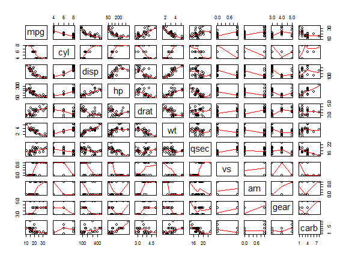

## Introduction

This document is produced by Slidify (the next slide will show some cool interactive graph produced using R)
Body Mass Index is an index used by health professionals to guage your general body weight/Fat Mass.  It is derived by the following formula

          BMI =  Body weight (in Kg) / (Height in meter)^2
        
Meaning of BMI        
<Table>
<TR><TD>Range</TD><TD>Meaning</TD></TR>
<TR><TD>>=30</TD><TD>Obese</TD></TR>
<TR><TD>>=25 & <=29.9</TD><TD>Overweight</TD></TR>
<TR><TD>>=18.5 & <=24.9</TD><TD>Normal</TD></TR>
<TR><TD><=18.4</TD><TD>Underweight</TD></TR>

</Table>

--- .class #id 


## How to use the BMI Calculator
1. On the side bar of the application, user can entire weight, height and the unit in either imperial or metric systems (ie lb vs Kg,  inch vs cm)
2. The app will do the conversion of the unit and calculate the BMI index
3. Based on the index, it will display comment of the weight status (obese, overweight etc)

--- .class #id


## Implementation details.

1. It is implementation with some form function
  - user can enter numeric data and use the drop down box to select which measurement system
  - either in Kg or lb
  - either in inch or cm
  - you can choose a combination of anything , eg body weight in lb and height in cm

2.  Data collected through the input
3.  It is converted in the server.R to the common unit, so calculation can be made with one common formula.  (This is in the function BMI)
4.  Another function in server.R is msg which will take the BMI value and display the comment about weight status (obese, overweigt etc)

--- .class #id 
## Demonstrate how R code can be run interactively in slidified document

```r
data(mtcars)
pairs(mtcars, panel = panel.smooth)
```

 


